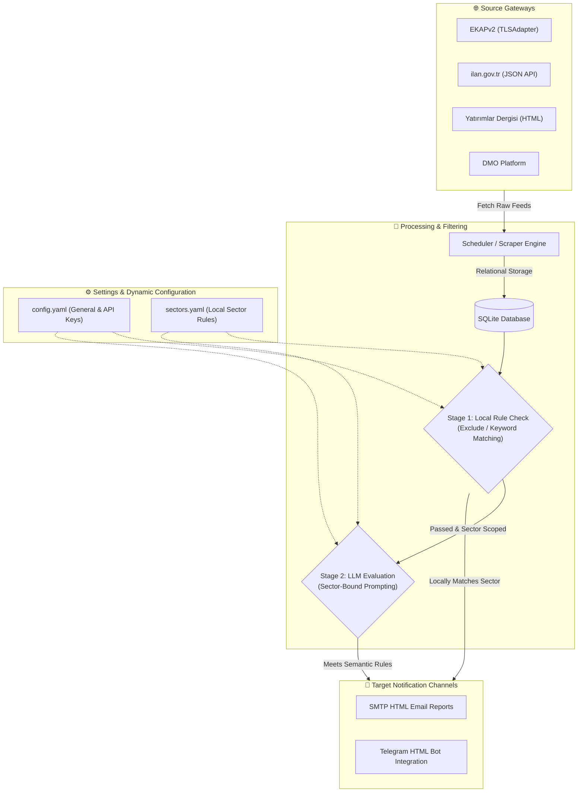

# 📡 Tender Tracker

### Automated Ingestion, Hybrid Filtering, and Intelligent Notification Engine


> **Architectural Abstract:** A modular, enterprise-ready notification and intelligence platform designed to scrape, filter, classify, and notify tenders from public and corporate procurement portals. It features a two-stage hybrid filter (local rule-based suffix matching coupled with targeted Large Language Model evaluation), dynamic multi-theme Single Page Application dashboard, and a background scheduler running seamlessly from a Windows system tray utility.

---

## 📑 Table of Contents
1. [Technical Evaluation & Engine Architecture](#-technical-evaluation--engine-architecture)
2. [System Architecture Flow](#-system-architecture-flow)
3. [Project Directory Structure](#-project-directory-structure)
4. [Arayüz Panelleri ve Görsel Kılavuz](#-arayüz-panelleri-ve-görsel-kılavuz)
5. [Kurulum, Yapılandırma ve Canlı Dağıtım](#-kurulum-yapılandırma-ve-canlı-dağıtım)
6. [Destek, Katkı ve Lisans (License & Contributing)](#-destek-katkı-ve-lisans-license--contributing)

---

## 📌 Technical Evaluation & Engine Architecture

Tender Tracker is architected as an asynchronous data harvesting and processing pipeline optimized for tracking public and private tender platforms. It replaces manual web searches with programmatic execution, utilizing dedicated concurrency models to minimize network and token costs.

### 1. Asynchronous Ingestion & Cipher Tuning
The engine abstracts connections to heterogeneous public gateways:
* **SSL/TLS Handshake Bypass:** Kamu (KIK/EKAP) gateways employ strict TLS fingerprinting that blocks traditional HTTP clients. Tender Tracker embeds a customized `TLSAdapter` on top of urllib3/requests to negotiate connections using specific cipher suites, preventing instant connection drops and certificate validation blocks.
* **Payload Optimization:** Rather than scraping raw DOM trees, the engine directly queries target JSON API routes when available. HTML feeds are processed using optimized, non-backtracking regular expressions and fast BeautifulSoup tokenizers to reduce CPU overhead during parsing.

### 2. Hybrid Multi-Stage Classification Pipeline
The system implements a strict priority filter stack to manage operational costs:
* **Stage 1 (Deterministic Keyword Rules):** Tenders are immediately evaluated against global exclusions and positive/negative suffix lists. By assigning a tender to a sector locally based on keyword suffix trees, the engine achieves instantaneous categorization with zero token cost.
* **Stage 2 (Sector-Bound LLM Inference):** To avoid unnecessary API costs, Large Language Model (LLM) filters (Gemini, OpenAI, Claude) are tied to target sectors. If a tender is categorized into "Rail Systems", only the LLM prompt related to rail systems is executed. Non-relevant tenders bypass LLM inference completely.
* **Background Database Re-evaluation:** Updating prompts or sector rules does not trigger website scrapes. The server spawns asynchronous worker threads (`threading.Thread`) using dedicated database sessions to re-evaluate the local SQLite database without incurring web traffic.

---

## 🏗️ System Architecture Flow



---

## 📦 Project Structure

```
tender-tracker/
│
├── .github/workflows/           # CI/CD pipelines (PyInstaller remote runner)
├── screenshots/                 # Application dashboard captures
├── src/                         # Backend source files
│   ├── classifier.py            # AI (Gemini, OpenAI, Claude) and Rule engine
│   ├── database.py              # SQLite configuration and schema models
│   ├── filter.py                # Local suffix matching and exclusion rules
│   ├── scheduler.py             # Background timer scheduler
│   └── scrapers/                # Web scraping scripts
│
├── static/                      # Frontend single page application
│   ├── index.html               # Main dashboard UI
│   ├── css/                     # Vanilla CSS style guide
│   └── js/                      # App routing and UI interactive logic
│
├── app.py                       # FastAPI application & server REST endpoints
├── run.py                       # System entry point (Windows System Tray App)
├── build.py                     # Portable PyInstaller executable compiler
├── config.yaml                  # System credentials and server configurations
└── sectors.yaml                 # Sector definitions and keywords dictionary
```

---

## 📸 Arayüz Panelleri ve Görsel Kılavuz

### 1. İlk Kurulum Sihirbazı (Setup Wizard)

Uygulama ilk defa çalıştırıldığında veya veritabanı sıfırlandığında kullanıcıyı bu karşılama ekranı karşılar. Burada sistem yöneticisi (admin) hesabı için güvenli bir kullanıcı adı ve şifre tanımlanır. Bu form gönderildikten sonra veritabanı şifrelenmiş kimlik bilgileriyle otomatik olarak ilklendirilir.


<br/>

### 2. Aktif İhaleler Paneli

Uygulamanın ana kontrol merkezidir. Taranan kaynaklardan toplanan tüm aktif ihaleleri listeler. Kullanıcılar ihalelerin yayımlanma tarihlerini, ihale numaralarını ve hangi sektöre sınıflandırıldıklarını bu ekrandan izleyebilir. Arayüzün solundaki menüde yeni ihale tespit edildiğinde yanan kırmızı bir uyarı simgesi (bildirim noktası) yer alır.


<br/>

### 3. Genel & LLM Yapılandırma Paneli

Sunucunun çalışacağı port adresi, arka plan botunun tarama sıklığı (dakika bazında) ve hangi kazayıcı kaynakların (Scrapers) aktif olacağı bu sekmeden düzenlenir. Aynı zamanda, yapay zeka sınıflandırma motoru için kullanılacak olan aktif API sağlayıcısı (Gemini, OpenAI, Claude) bu ekrandan seçilir.


<br/>

### 4. Arayüz Renk Temaları (8 Farklı Palet Gösterimi)

Uygulama, modern koyu tema üzerine inşa edilmiş ve sunucu ile anlık senkronize olan 8 farklı renk temasına sahiptir. Aşağıda Turkuaz (Cyan), Zümrüt (Emerald), Turuncu (Sunset) ve Mor (Purple) renk temalarının birleşik görünümü sunulmuştur. Değiştirilen tema ayarları doğrudan `config.yaml` dosyasına sunucu taraflı kaydedilir.


<br/>

### 5. Özel Yapay Zeka Süzgeçleri ve Yeniden Değerlendirme (LLM Prompts)

Sektör filtrelerini geçen ihaleleri anlamsal olarak analiz etmek için kullanılan özel LLM promptlarının yönetildiği alandır. Promptlar belirli bir sektörle ilişkilendirilerek token tasarrufu sağlanır. "Yeniden Değerlendir" butonu, veritabanındaki mevcut ihaleleri asenkron bir arka plan iş parçacığıyla yeni kurallara göre tekrar sınıflandırır.


<br/>

### 6. Sektör Kuralları ve Küresel Filtreler Paneli

İşletmenizin ilgi alanına giren anahtar kelimelerin (pozitif) ve istenmeyen durumların (negatif) yönetildiği kural tabanlı yapıdır. En üstte sabit olarak yer alan "Küresel Yasaklı Kelimeler" kartı, bu kelimeleri içeren ihaleleri sisteme hiç kaydetmeden ilk aşamada eler.


<br/>

### 7. SMTP E-Posta ve Telegram Bildirim Paneli

Sınıflandırılan ihalelerin kullanıcılara anlık olarak ulaştırılmasını sağlayan entegrasyon ayarlarıdır. SMTP sunucu bilgileri, gönderici/alıcı e-posta adresleri ve Telegram Bot belirteçleri (Token ve Chat ID) bu panelden düzenlenir. Eksik parametre girildiğinde sistem tepsisinde ve loglarda uyarılar gösterilir.


<br/>

### 8. Şifre Güncelleme Paneli

Kullanıcı adı ve mevcut yönetici şifresinin güvenli bir şekilde güncellendiği paneldir. Tasarım tutarlılığı açısından, bu sekmedeki form onay butonu da diğer sekmelerle aynı yapıda, sağa hizalı, yeşil vurgulu ve disket simgeli olacak şekilde tasarlanmıştır.


<br/>

### 9. Olay Günlüğü Terminali (Live Logs Viewer)

Sistem arka plan işleyişini, tarayıcı botun adımlarını, veritabanı kayıt işlemlerini ve API hata kodlarını canlı olarak izleyebileceğiniz entegre terminal arayüzüdür. Arka planda herhangi bir hata veya uyarı logu oluştuğunda sol menüdeki "Sistem Logları" sekmesinin yanında kırmızı uyarı noktası belirir.


---

## 🚀 Kurulum, Yapılandırma ve Canlı Dağıtım

### 1. Yerel Ortam Kurulumu ve Python ile Çalıştırma
Uygulamayı bilgisayarınızda kaynak koddan çalıştırmak için aşağıdaki adımları sırasıyla uygulayın:
1. Depoyu yerel bilgisayarınıza klonlayın:
   ```bash
   git clone https://github.com/isikmuhamm/tender-tracker.git
   cd tender-tracker
   ```
2. Python sanal ortamı (virtual environment) oluşturun ve aktif edin:
   ```bash
   python -m venv venv
   # Windows için:
   venv\Scripts\activate
   # macOS/Linux için:
   source venv/bin/activate
   ```
3. Gerekli bağımlılık paketlerini yükleyin:
   ```bash
   pip install -r requirements.txt
   ```
4. Sistem tepsisi entegrasyonuyla beraber uygulamayı başlatın:
   ```bash
   python run.py
   ```
*Uygulama başladıktan sonra tarayıcınızdan `http://127.0.0.1:8000` adresine giderek kontrol paneline erişebilirsiniz.*

### 2. PyInstaller ile Bağımsız (.exe) Dosya Derleme
Uygulamayı herhangi bir Python kurulumuna ihtiyaç duymadan çalıştırılabilen tekil bir Windows çalıştırılabilir dosyası (.exe) haline getirmek için:
```bash
python build.py
```
Derleme bittiğinde tekil binary dosyanız `dist/tender-tracker.exe` dizini altında hazır olacaktır.

### 3. Olası Hatalar ve Çözümleri (Troubleshooting)
* **Windows Defender / SmartScreen Uyarısı:** Dijital sertifika imzası barındırmayan bağımsız derlemelerde Windows uyarı verebilir. Ayrıntılar kısmından *"Yine de Çalıştır"* seçeneğini işaretleyerek aşabilirsiniz.
* **Sunucu Portunun Dolu Olması:** Sunucu varsayılan olarak `8000` portunu dinler. Port çakışması durumunda `config.yaml` dosyasını açıp `server_port` değerini boşta olan başka bir portla (örneğin `8085`) değiştirip programı yeniden başlatın.
* **Verilerin Taşınabilirliği (Portable):** Uygulama tüm veritabanı kayıtlarını (`tenders.db`), logları (`events.log`) ve ayar dosyalarını (`config.yaml`, `sectors.yaml`) kendi çalıştığı dizinde oluşturur. Programı taşımak için exe dosyasıyla birlikte bu dosyaları da taşımanız yeterlidir.

---

## 📢 Destek, Katkı ve Lisans (License & Contributing)

### Katkıda Bulunma (Contributing)
Projenin geliştirilmesine katkıda bulunmak isterseniz:
1. Projeyi forklayın.
2. Yeni bir özellik veya hata giderme için branch açın (`git checkout -b feature/yeniozellik`).
3. Değişikliklerinizi commit edin (`git commit -m 'feat: yeni özellik eklendi'`).
4. Branch'inizi push edin (`git push origin feature/yeniozellik`).
5. Bir Pull Request (PR) oluşturun.

### Lisans (License)
Bu proje **MIT Lisansı** altında lisanslanmıştır. Ücretsiz olarak bireysel ve ticari amaçlarla kullanılabilir, kopyalanabilir ve dağıtılabilir. Detaylar için [LICENSE](file:///c:/Users/MAHMET/Desktop/Projects/tender-tracker/LICENSE) dosyasına göz atabilirsiniz.

### İletişim (Contact)
Her türlü soru, hata bildirimi veya iş birliği talepleriniz için [isikmuhamm](https://github.com/isikmuhamm) profili üzerinden iletişime geçebilirsiniz.
