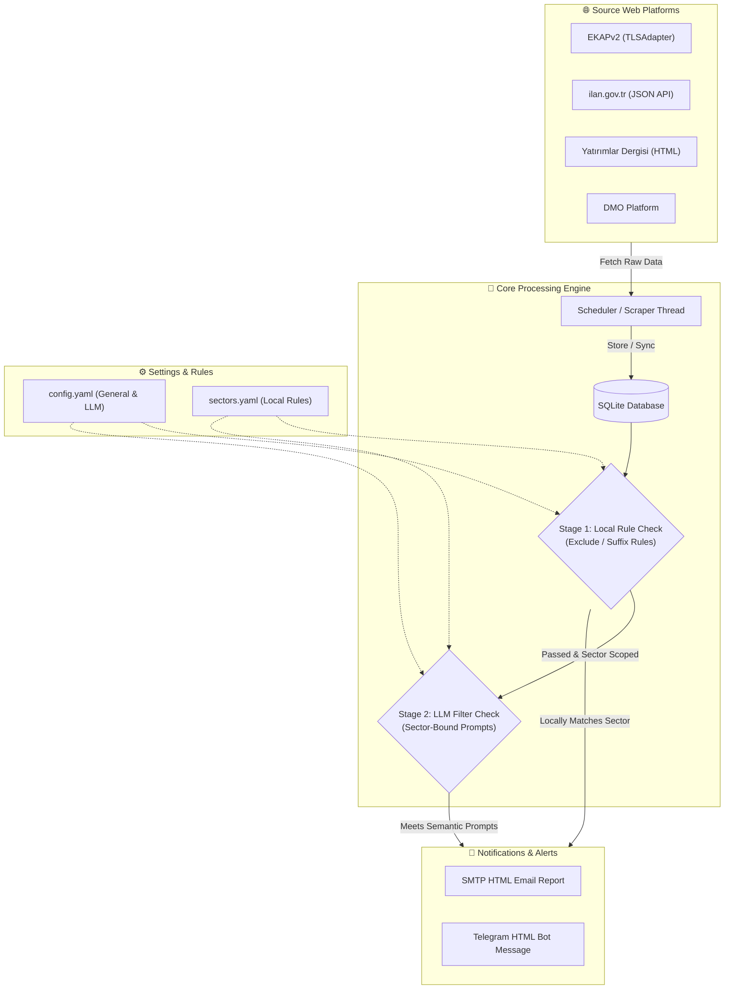

# 📡 Tender Tracker

### Automated Tender Ingestion, Hybrid Semantic Filtering, and Notification Engine


---

## 📌 Technical Evaluation / Teknik Değerlendirme

### **TR | Teknik Değerlendirme ve Mimari Analiz**
Tender Tracker, dağıtık ve heterojen kamu/özel ihale platformlarından (HTML, JSON API, SOAP/XML) asenkron veri toplama ve işleme mimarisi üzerine kurulmuştur.
* **Veri Toplama Katmanı (Scraper Engine):**
  * **EKAPv2:** Kik/EKAP altyapısındaki SSL/TLS el sıkışma katı kurallarını ve oturum limitlerini aşabilmek için özel bir `TLSAdapter` (üçüncü taraf şifreleme profillerini taklit eden) ve oturum (Session) yönetimi kullanır.
  * **ilan.gov.tr:** HTTP web arayüzü yerine arka plandaki JSON API uç noktalarını doğrudan sorgulayarak veri trafiğini ve payload boyutunu optimize eder.
  * **Yatırımlar Dergisi:** HTML tablolarını ve bülten formatını regex/BeautifulSoup ile ayrıştırarak yapılandırılmış SQLite satırlarına dönüştürür.
* **İki Aşamalı Hibrit Sınıflandırma ve Hız/Token Optimizasyonu:**
  * **1. Aşama (Kural Tabanlı Eleme):** İhaleler LLM'e gönderilmeden önce yerel kurallarla (pozitif/negatif anahtar kelimeler ve küresel yasaklı kelimeler) taranır. Eşleşme durumunda doğrudan sınıflandırılır (0ms gecikme, 0 token maliyeti).
  * **2. Aşama (Öncelikli Sektör Eşli LLM Değerlendirmesi):** LLM süzgeçleri (Gemini, OpenAI, Claude) sadece belirli bir öncelikli sektörle eşleştirildiğinde tetiklenir. İhale o sektörde değilse LLM çağrısı yapılmaz. Bu sayede token maliyeti %90'a kadar düşürülür.
* **Veritabanı Arka Plan Yeniden Değerlendirme (Re-evaluation):** Yeni bir LLM filtresi eklendiğinde, dış siteleri yeniden taramadan veritabanındaki ihaleler üzerinde asenkron (`threading.Thread`) arka plan oturumuyla LLM promptları çalıştırılarak veriler güncellenir.
* **Dinamik Ön Yüz Routing & Tema Kontrolü:** Single Page Application (SPA) olarak tasarlanan ön yüzde History API yönlendirmesi kullanılır. 8 farklı renk teması desteği sunucudaki `config.yaml` ile senkronize çalışır.

### **EN | Technical Evaluation and Architectural Analysis**
Tender Tracker is designed as an asynchronous data ingestion and processing pipeline for harvesting opportunities from distributed and heterogeneous public/private tender platforms.
* **Data Ingestion Layer (Scraper Engine):**
  * **EKAPv2:** Employs a custom `TLSAdapter` mimicking specific cipher suites alongside persistent session management to bypass strict SSL/TLS handshakes and session limit constraints.
  * **ilan.gov.tr:** Queries raw JSON backend API endpoints directly rather than parsing DOM trees, minimizing overhead and payload size.
  * **Yatırımlar Dergisi:** Parses unstructured HTML newsletter tables into fully typed relational database models using optimized regex and BeautifulSoup tokenizers.
* **Two-Stage Hybrid Classification & Cost/Latency Optimization:**
  * **Stage 1 (Rule-Based Local Matching):** Tenders are evaluated against global exclusions and positive/negative sector keyword rules. Matches are instantly classified locally (0ms latency, zero token costs).
  * **Stage 2 (Sector-Bound LLM Inference):** Custom LLM prompts (Gemini, OpenAI, Claude) are scoped to specific target sectors. The LLM API is only contacted if a tender lands in the corresponding sector, lowering monthly token consumption by up to 90%.
* **Database Background Re-evaluation:** Adding or modifying LLM custom filters triggers a background async worker thread (`threading.Thread`) using dedicated database sessions. This re-evaluates previously imported tenders without requesting source websites again.
* **Dynamic Frontend Routing & Theme Control:** Built as a modern SPA utilizing History API routing for clean URLs. Supports 8 color schemes synchronized natively with the backend `config.yaml`.

---

## 🏗️ System Architecture



---

## 📦 Project Structure

```
tender-tracker/
│
├── .github/workflows/           # CI/CD workflows (PyInstaller build pipeline)
├── screenshots/                 # Application interface screenshots
├── src/                         # Python backend source files
│   ├── classifier.py            # Hybrid classification rules & LLM handlers
│   ├── database.py              # SQLite database models & sessions
│   ├── filter.py                # Local suffix matching and exclusions
│   ├── scheduler.py             # Background tasks runner & scraper timers
│   └── scrapers/                # Scraper modules (EKAP, DMO, ilan.gov.tr, vb.)
│
├── static/                      # Web dashboard frontend assets
│   ├── index.html               # Single Page Application HTML markup
│   ├── css/                     # Vanilla CSS style sheets
│   └── js/                      # app.js routing & user event logic
│
├── app.py                       # FastAPI application & server REST endpoints
├── run.py                       # System entry point (Topshelf Tray Icon & App)
├── build.py                     # Local standalone compilation runner
├── config.yaml                  # System configuration (API keys, ports, SMTP)
└── sectors.yaml                 # Rules & keywords database
```

---

## 📸 Screenshots (Arayüz Panelleri)

### 1. Aktif İhaleler Paneli
Sistem tarafından taranıp sınıflandırılan tüm ihalelerin listelendiği, sektöre ve kaynağa göre filtrelenebildiği ana ekrandır.


### 2. Arayüz Renk Temaları (4'lü Birleşik Görünüm)
Uygulama; sunucu tarafı `config.yaml` ile tam senkronize çalışan 8 farklı renk temasına sahiptir. Aşağıda Turkuaz (Cyan), Zümrüt (Emerald), Turuncu (Sunset) ve Mor (Purple) temalarının birleşik görünümü yer almaktadır:


### 3. Akıllı Süzgeçler (LLM Prompts) ve Yeniden Değerlendirme Paneli
Yapay zeka analizinde kullanılacak olan prompt yönergelerinin tanımlandığı, öncelikli sektöre bağlanabildiği ve veritabanındaki ihalelerin arka planda yeniden süzgeçten geçirilmesini sağlayan sekmedir.


### 4. Sektörler ve Küresel Yasaklı Kelimeler Paneli
İşletmenizin faaliyet alanlarına göre pozitif/negatif kelimelerin ve ihaleleri tamamen eleyen küresel yasaklı kelimelerin en üstte sabit kart olarak yönetildiği alandır.


### 5. Bildirim Ayarları Paneli
SMTP e-posta gönderici/alıcı bilgileri ve Telegram Bot entegrasyonu (Token, Chat ID) bilgileri bu sekmeden düzenlenir.


### 6. Sistem Logları Paneli
Arka planda çalışan tarayıcı botun ve sunucunun log kayıtlarını (hata ve durum analizleri) canlı olarak takip edebileceğiniz konsoldur.


---

## 🚀 Kurulum ve Kullanım (Usage Guide)

### 1. Lokal Geliştirme (Python ile Çalıştırma)
Sistemi yerel Python ortamınızda test etmek için şu adımları izleyin:
```bash
# Depoyu klonlayın
git clone https://github.com/isikmuhamm/tender-tracker.git
cd tender-tracker

# Bağımlılıkları yükleyin
pip install -r requirements.txt

# Uygulamayı başlatın (Sistem tepsisinde çalışacaktır)
python run.py
```
Arayüze erişmek için tarayıcınızdan `http://127.0.0.1:8000` adresine gidin.

### 2. PyInstaller ile Tekil (.exe) Derleme
Uygulamayı harici bağımlılıklara ihtiyaç duymadan çalıştırılabilen tek bir `.exe` dosyası haline getirmek için:
```bash
python build.py
```
Derleme işlemi tamamlandığında standalone dosyanız `dist/tender-tracker.exe` konumunda hazır olacaktır.

### 3. Sorun Giderme (Troubleshooting)
* **Windows SmartScreen / Defender Uyarısı:** Dijital sertifika imzası olmadığı için uyarı verebilir. *"Ek Bilgi"* kısmına tıklayıp *"Yine de Çalıştır"* seçeneğini seçin.
* **Port Çakışması:** Port `8000` kullanımdaysa `config.yaml` dosyasını açıp `server_port` değerini boşta olan başka bir portla (örneğin `8085`) değiştirin.
* **Veriler ve Veritabanı:** Uygulama tamamen taşınabilir (portable) çalışır. `tenders.db`, `events.log` ve yapılandırma dosyaları `.exe` dosyasıyla aynı dizinde oluşturulur.
