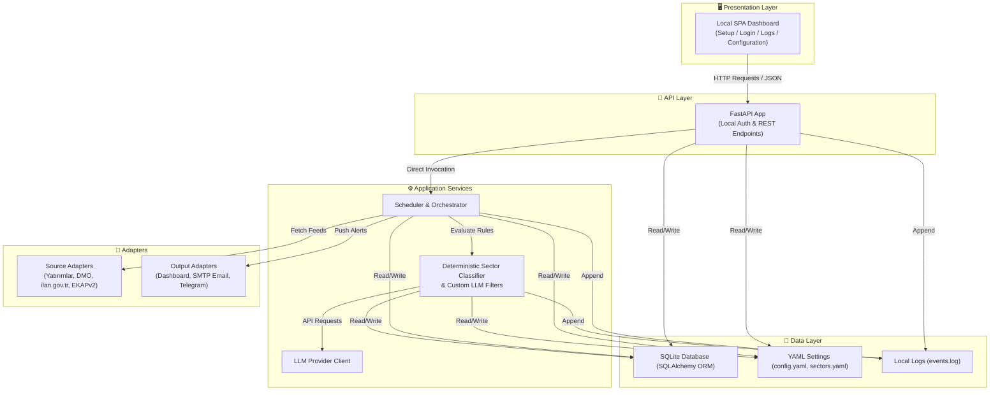
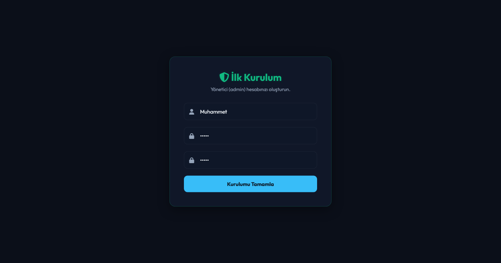
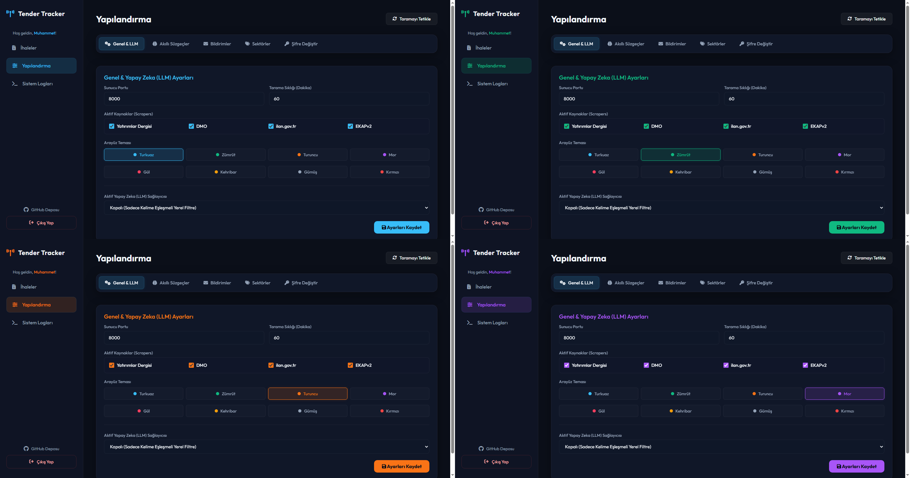
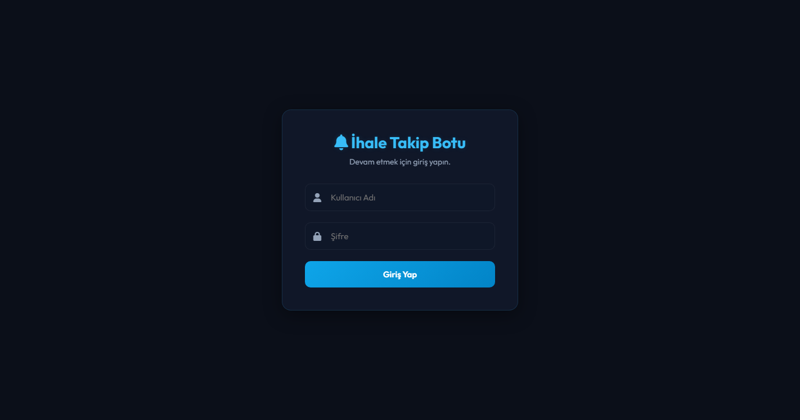
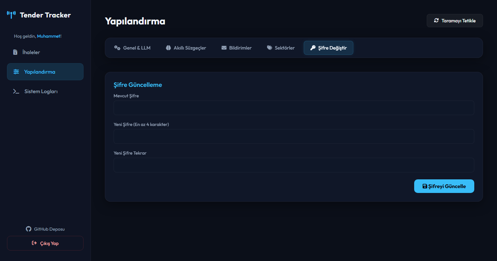

# 📡 Tender Tracker


**Local-first tender ingestion, deterministic sector classification, optional LLM filtering, and multi-channel notification.**
---

## 📑 Table of Contents
1. [Development Status](#development-status)
2. [Overview](#overview)
3. [Technical Assessment](#technical-assessment)
4. [Key Features](#key-features)
5. [Processing Pipeline](#processing-pipeline)
6. [Supported Sources](#supported-sources)
7. [System Architecture](#system-architecture)
8. [Installation](#installation)
9. [Configuration](#configuration)
10. [Kullanım Kılavuzu ve Ekranlar](#kullanım-kılavuzu-ve-ekranlar)
11. [Sorun Giderme (Troubleshooting)](#windows-smartscreen-veya-defender-uyarısı)
12. [Testing And Build](#testing-and-build)
13. [Current Limitations](#current-limitations)
14. [Project Documentation](#project-documentation)
15. [Contributing](#contributing)
16. [License](#license)

---

## Development Status

> **Tender Tracker is operational for local, self-managed use and can be used on your own machine with your own configuration and provider credentials. The project remains under active development.**
>
> Yatırımlar Dergisi, DMO, ilan.gov.tr, and EKAPv2 adapters provide the main ingestion paths. Reliability, security hardening, packaging, and source compatibility work continue between releases.
>
> **Kullanım notu:** Uygulama mevcut çalışan kaynaklarla kendi bilgisayarınızda bağımsız olarak kullanılabilir. Geliştirme devam ettiği için iş açısından kritik sonuçların kaynak kayıtları ve uygulama logları üzerinden doğrulanması önerilir.

Tender Tracker is not a hosted procurement service and does not provide centrally managed API credentials. Users operate the application locally and are responsible for their own source access, provider keys, notification accounts, backups, and usage decisions.

---

## Overview

Tender Tracker collects public tender listings from multiple Turkish procurement sources, normalizes the incoming records, removes irrelevant listings through deterministic rules, assigns relevant opportunities to user-defined sectors, and optionally evaluates them through user-defined Large Language Model filters.

The application is intended for technical sales, presales, engineering, business development, procurement, and market-intelligence workflows where users repeatedly inspect multiple tender portals and need a reusable local filtering process.

Core design goals:

- keep tender data and configuration on the user's computer;
- perform cheap deterministic filtering before optional LLM calls;
- allow sector and prompt rules to be changed without rewriting source adapters;
- preserve a searchable local tender history;
- deliver relevant records through dashboard, email, or Telegram;
- remain usable without an LLM provider.


---

## Technical Assessment

Tender Tracker has evolved from a single-purpose scraping script into a modular local application with clear source, classification, persistence, API, frontend, and notification boundaries.

### What The Current Architecture Does Well

#### 1. Source Isolation

Each procurement source is represented by its own adapter. Source-specific request, parsing, and normalization behavior is kept outside the core classification and notification flow. A failure or markup change in one source can therefore be investigated without redesigning the entire application.

#### 2. Local-First Processing

SQLite, YAML configuration, and event logs are stored locally. The project does not require a Tender Tracker cloud account or a centrally operated backend. Optional external calls are limited to enabled tender sources, the user's selected LLM provider, SMTP, and Telegram.

#### 3. Deterministic-First Classification

Global exclusion rules and sector keyword rules are evaluated before optional LLM work. This keeps common decisions fast, inspectable, and available when no API key is configured.

#### 4. Optional Semantic Filtering

Gemini, OpenAI-compatible providers, and Anthropic Claude can be configured by the user. LLM use is optional and is used for user-defined semantic filters scoped to one sector or all sectors.

#### 5. Portable Product Surface

FastAPI, the local dashboard, SQLite storage, configuration files, and the Windows tray integration can be distributed as a portable executable. GitHub Actions provides automated tests and tag-based Windows release builds.

### Current Engineering Boundaries

The project should be understood as an **operational local application under active development**, not as a finished enterprise procurement platform.

- The HTTP source adapters use normal synchronous request flows coordinated by application workers; this is not a fully asynchronous crawler fleet.
- The dashboard supports manual ingestion triggers. CLI utilities also expose one-shot and daemon-style execution; lifecycle unification between source execution and packaged desktop operation remains an engineering work item.
- Database re-evaluation currently re-runs custom LLM filters on stored, already classified tenders. It does not represent a complete re-ingestion or universal reclassification of every rule layer.
- SQLite WAL mode improves local read/write concurrency but does not eliminate every possible locking or transaction failure.
- Source portals remain external dependencies. A portal can change its HTML, API route, TLS policy, rate limits, or availability without notice.

Critical hardening work is tracked in [`business/BOARD.md`](business/BOARD.md); deferred productization and infrastructure work is preserved in [`business/NOTES.md`](business/NOTES.md) rather than hidden behind a production-ready claim.

---

## Key Features

### Multi-Source Tender Ingestion

- Yatırımlar Dergisi HTML listings;
- DMO active tender listings;
- ilan.gov.tr public JSON requests;
- EKAPv2 public connection adapter using signed API headers;
- duplicate detection before repeated processing;
- normalized source, title, summary, link, and classification fields.

### Hybrid Classification

- global exclusion keywords;
- sector-specific positive and negative keywords;
- local deterministic sector assignment;
- custom LLM filters targeted to selected sectors;
- stored-tender re-evaluation for custom LLM prompt changes.

### Bring Your Own LLM

Supported provider families:

- Google Gemini;
- OpenAI and compatible chat-completions endpoints;
- Anthropic Claude.

Provider use is optional. The application remains functional with local rules only.

### Local Dashboard

- first-run administrator setup;
- local login and protected API routes;
- tender, source, sector, and custom-filter views;
- general, LLM, sector, notification, and security settings;
- operational log viewer;
- eight persisted interface themes;
- lightweight notification dots for new tenders and warnings.

### Notification Channels

- sector-grouped HTML email reports over SMTP;
- Telegram Bot API notifications;
- automatic splitting of long Telegram messages;
- local delivery-state fields for stored tenders.

### Packaging And Delivery

- PyInstaller Windows executable;
- Windows system-tray integration;
- automated test workflow;
- tag-based Windows build and GitHub Release upload.

---

## Processing Pipeline

```mermaid
flowchart TD
    A[Public Tender Sources] --> B[Source Adapters]
    B --> C{Already Stored?}
    C -->|Yes| X[Skip Duplicate]
    C -->|No| D{Global Exclusion Match?}
    D -->|Yes| E[(Store as Excluded)]
    D -->|No| F[Local Sector Rules]
    F -->|Matched| H[Sector Assigned]
    F -->|No Match| J[Unclassified]
    H --> K[Sector-Scoped Custom LLM Filters]
    K --> L[(SQLite)]
    J --> L
    L --> M[Dashboard (All Tenders)]
    L --> N{Has Sector & Not Excluded?}
    N -->|Yes| O[Optional Notifications<br/>(Email & Telegram)]
    N -->|No| P[Dashboard Only]
```

The processing contract follows these rules:
- **Unclassified Tenders:** Tenders that do not match any positive local sector rules are stored in the database and shown on the dashboard only. They do not trigger LLM calls or send notifications.
- **Custom LLM Filters:** User-defined semantic filters run only on tenders that have been successfully mapped to a sector via local rules.
- **Notifications:** Email and Telegram notifications are dispatched only for records that are mapped to a valid sector and are not marked as `Excluded` (no notifications are sent for unclassified or excluded tenders).

The practical execution order is:

```text
source ingestion
→ normalization and duplicate check
→ global exclusions
→ deterministic sector classification
→ optional sector-scoped custom LLM filters
→ SQLite persistence
→ dashboard / email / Telegram (filtered by sector presence)
```

No fixed token-saving percentage is claimed. Actual savings depend on source volume, rule coverage, selected sectors, prompt design, and provider behavior.

---

## Supported Sources

| Source | Integration | Sync Strategy | Current Status |
|---|---|---|---|
| **Yatırımlar Dergisi** | HTML parsing | Snapshot of current homepage | Operational |
| **Devlet Malzeme Ofisi (DMO)** | HTML parsing | Current active listings parser | Operational |
| **ilan.gov.tr** | JSON API | Paged request of current listings | Operational |
| **EKAPv2** | Signed JSON API | Initial crawl of open tenders, then stateful incremental sync | Operational |

### EKAP Scope

The intended EKAP scope is limited to publicly accessible tender listings that can be read without account login, e-signature, or private-session automation.

The current adapter extracts public tender records by querying the public search API of EKAP v2 with custom signed security headers.

Authenticated pages, e-signature flows, CAPTCHA bypass, private account automation, and restricted procurement data are outside the project scope.

---

## System Architecture



### Project Structure

```text
tender-tracker/
├── .github/workflows/        # Test and tagged release workflows
├── business/                 # Active board, decisions, and history
├── screenshots/              # Dashboard and configuration captures
├── src/
│   ├── scraper/              # Source-specific adapters
│   ├── notifier/             # Email and Telegram adapters
│   ├── classifier.py         # Local sector rules and custom LLM filter evaluation
│   ├── database.py           # SQLite and SQLAlchemy models
│   ├── filter.py             # Exclusion and sector rules
│   ├── llm_client.py         # Provider abstraction
│   ├── scheduler.py          # Ingestion orchestration
│   └── tray.py               # Windows tray integration
├── static/                   # Local single-page dashboard
├── app.py                    # FastAPI application and desktop web entry
├── run.py                    # CLI ingestion utilities
├── build.py                  # PyInstaller build script
├── config.yaml               # Local runtime configuration
├── sectors.yaml              # Sector definitions and keyword rules
├── AGENTS.md                 # Agent and contributor working rules
└── README.md
```

### Technology Stack

| Layer | Technology | Purpose |
|---|---|---|
| Backend | Python 3.12, FastAPI | Local API and application server |
| Persistence | SQLite, SQLAlchemy | Tender, user, and delivery state |
| Scraping | Requests, BeautifulSoup | Public HTML and JSON ingestion |
| Classification | Local rules, optional LLM APIs | Sector and semantic filtering |
| Frontend | HTML, CSS, vanilla JavaScript | Local single-page dashboard |
| Notifications | SMTP, Telegram Bot API | Optional tender delivery |
| Packaging | PyInstaller, PyStray | Portable Windows application |
| CI/CD | GitHub Actions | Tests, Windows build, release asset |

---

## Installation

### Option 1: Windows Executable

1. Open the repository's **Releases** page.
2. Download the latest `tender-tracker.exe` release asset.
3. Place the executable in a folder where your Windows user has write permission.
4. Run the executable.
5. If Windows SmartScreen displays a warning, review the publisher information and use **More info → Run anyway** only when you downloaded the file from the expected repository release.
6. Complete the first-run administrator setup in the browser.

Portable runtime files are created beside the executable. Keep `tenders.db`, `config.yaml`, `sectors.yaml`, and `events.log` when replacing or moving the executable.

### Option 2: Run From Source

```bash
# Clone the repository
git clone https://github.com/isikmuhamm/tender-tracker.git
cd tender-tracker

# Create a virtual environment
python -m venv .venv

# Windows
.venv\Scripts\activate

# Linux/macOS
source .venv/bin/activate

# Install dependencies
python -m pip install --upgrade pip
pip install -r requirements.txt

# Start the local dashboard
python app.py
```

Open `http://127.0.0.1:8000` if the browser does not open automatically.

### Command-Line Utilities & Windows Task Scheduler

The compiled executable `tender-tracker.exe` (or the Python script `run.py`) can be executed directly as a command-line tool. This allows headless execution, perfect for setting up a daily automated task in **Windows Task Scheduler**.

#### Supported CLI Arguments:
* `--once`: Runs a single ingestion cycle (fetches new tenders, saves them, sends notifications) and exits.
  * **Exit Codes:** `0` on complete success, `2` on partial success (some scrapers or notifiers failed), and `1` on exceptions or critical failures.
* `--stats`: Prints the current local database statistics (total scanned, excluded, classified, unclassified, and distribution per sector/source) and exits immediately with code `0` (or `1` on error).
* `--daemon`: Runs continuously as a background process, sleeping and running scans at the configured interval (for Python execution).

#### Windows Task Scheduler Configuration:
To set up a daily automatic scan task using the Windows Task Scheduler:
1. Create a new **Basic Task** and set the trigger to daily (e.g., 9:00 AM).
2. Set the action to **Start a Program**.
3. In **Program/script**, specify the absolute path to the compiled executable:
   `C:\path\to\tender-tracker.exe`
4. In **Add arguments (optional)**, enter:
   `--once`
5. In **Start in (optional)**, enter the directory containing the executable (e.g., `C:\path\to\`). **ÖNERİLEN:** `Start in` alanına EXE klasörünü yazmak önerilir ancak paketlenmiş uygulama runtime dosyalarını (`config.yaml`, `sectors.yaml`, `tenders.db`) her zaman EXE’nin bulunduğu klasörde arar.

---

### Build & Update The Windows Executable

To compile the single portable Windows executable yourself, run:

```bash
python build.py
```

The generated file is written to:

```text
dist/tender-tracker.exe
```

> [!TIP]
> **Yedekleme ve Güncelleme Önerisi (Backup Advice):** Yeni bir sürüme geçmeden önce runtime dosyalarını (`tenders.db`, `config.yaml`, `sectors.yaml`) yedeklemeniz önerilir. Projede henüz sürümlendirilmiş otomatik bir veritabanı migrasyon sistemi bulunmadığından, özellikle şema/yapı değişikliği getiren ana güncellemelerde release notlarını ve uyumluluk yönergelerini kontrol etmeniz faydalı olacaktır.

---

## Configuration

The dashboard writes application settings to local YAML files after authentication.

### General Settings

- local server port;
- enabled source adapters;
- scan interval value;
- active LLM provider;
- selected visual theme.

### Classification Settings

- global exclusion keywords;
- enabled sectors;
- sector positive keywords;
- sector negative keywords;
- custom LLM filters;
- target sector for each custom filter.

### LLM Providers

Users provide their own credentials locally. Tender Tracker does not operate a shared provider account or hosted key vault.

Recommended practice:

- use a dedicated provider key with an appropriate usage limit;
- do not commit populated configuration files;
- do not include API keys in screenshots, logs, or bug reports;
- revoke and replace a key if it is accidentally exposed.

### Notifications

- SMTP server, port, sender, username/password, and recipients;
- Telegram bot token and target chat ID.

### Access Points

| Service | URL | Description |
|---|---|---|
| Dashboard | `http://127.0.0.1:8000/` | Local application interface |
| API Docs | `http://127.0.0.1:8000/docs` | Interactive FastAPI documentation |
| OpenAPI | `http://127.0.0.1:8000/openapi.json` | Machine-readable API schema |

### API Overview

```text
POST /api/auth/setup                 Create the first local administrator
POST /api/auth/login                 Obtain a local access token
POST /api/auth/change-password       Change administrator credentials
GET  /api/tenders                    List and filter stored tenders
POST /api/tenders/trigger            Start a manual ingestion cycle
POST /api/tenders/re-evaluate        Re-run custom LLM filters on stored tenders
GET  /api/config                     Read local configuration
POST /api/config                     Save local configuration
GET  /api/models                     List available provider models
GET  /api/logs                       Read recent local event logs
```

---

# Kullanım Kılavuzu ve Ekranlar

Bu bölüm uygulamayı ilk kez çalıştıran kullanıcılar için temel kullanım sırasını ve arayüz panellerini açıklar.

## Önerilen İlk Kullanım Sırası

1. Uygulamayı yazma izniniz olan bir klasörde çalıştırın.
2. İlk yönetici hesabını oluşturun.
3. **Genel Ayarlar** bölümünden kullanılacak kaynakları seçin.
4. **Sektörler ve Filtreler** bölümünde kendi ilgi alanlarınızı tanımlayın.
5. LLM kullanacaksanız sağlayıcı ve model ayarını yapın; kullanmayacaksanız `none`/pasif durumda bırakın.
6. İhtiyaç varsa özel LLM süzgeçleri oluşturun.
7. E-posta veya Telegram bildirimlerini yapılandırın.
8. **Otomatik Tarama:** Uygulama açıldığında otomatik tarama arka planda kendiliğinden başlatılır.
9. **Manuel Tarama:** İhtiyaç duyduğunuzda, **Aktif İhaleler** ekranından manuel tarama butonunu kullanarak anlık ek tarama tetikleyebilirsiniz.
10. Beklenmeyen sonuç veya kaynak hatalarında **Sistem Logları** ekranını kontrol edin.

## 1. İlk Kurulum Sihirbazı

Uygulama ilk çalıştırıldığında yerel yönetici hesabı oluşturulur. Girilen şifre düz metin olarak saklanmaz; uygulamanın kimlik doğrulama mekanizması için parola özeti kaydedilir.

- kullanıcı adını ve şifreyi güvenli bir yerde saklayın;
- uygulama varsayılan olarak yalnız yerel `127.0.0.1` adresinde kullanılmalıdır;
- veritabanını silmek kullanıcı ve tender kayıtlarını da etkileyebilir; işlem öncesinde yedek alın.



<br/>

## 2. Aktif İhaleler Paneli

Bu panel yerel veritabanına kaydedilen ihale kayıtlarının ana görünümüdür.

Buradan:

- kaynak, sektör ve özel filtre sonuçlarını görebilir;
- kayıtları filtreleyebilir;
- yeni bir manuel tarama başlatabilir;
- yeni ihale bildirim noktasını takip edebilirsiniz.

Bir kaynakta ihale görülmesine rağmen panelde görünmüyorsa önce küresel yasaklı kelimeleri, sektör kurallarını ve sistem loglarını kontrol edin.


<br/>

## 3. Genel ve LLM Yapılandırma Paneli

Bu bölüm uygulamanın çalışma ve sağlayıcı ayarlarını içerir.

Başlıca ayarlar:

- sunucu portu;
- etkin kaynak adaptörleri;
- tarama aralığı;
- etkin LLM sağlayıcısı;
- sağlayıcı modeli ve API anahtarı;
- arayüz teması.

LLM anahtarı girmeden de küresel ve sektörel yerel filtreler kullanılabilir. LLM devre dışı olduğunda özel semantik süzgeçler çalıştırılmaz; yerel sektör sınıflandırması çalışmaya devam eder.


<br/>

## 4. Arayüz Renk Temaları

Arayüz sekiz farklı renk paleti sunar. Tema tercihi yerel yapılandırmaya kaydedilir ve sonraki açılışlarda korunur.

Tema seçimi yalnız sunumu etkiler; ihale toplama, sınıflandırma veya bildirim davranışını değiştirmez.



<br/>

## 5. Özel LLM Süzgeçleri ve Yeniden Değerlendirme

Özel süzgeçler, sektör sınıflandırmasından sonra daha dar bir iş ihtiyacını semantik olarak değerlendirmek için kullanılır.

Örnek kullanım alanları:

- yalnız sinyalizasyon veya raylı sistem projelerini ayırma;
- belirli ürün, hizmet veya teknoloji ihtiyacını arama;
- genel bir sektörde satış açısından uygun fırsatları işaretleme;
- bir süzgeci yalnız seçilen sektörde çalıştırarak gereksiz provider çağrılarını azaltma.

**Yeniden Değerlendir** işlemi mevcut veritabanındaki uygun kayıtlar üzerinde özel LLM süzgeçlerini tekrar çalıştırır. Bu işlem web sitelerini yeniden taramakla veya tüm sektör sınıflandırmasını sıfırdan yapmakla aynı değildir.


<br/>

## 6. Sektör Kuralları ve Küresel Filtreler

Yerel sınıflandırmanın ana yönetim ekranıdır.

- **Küresel yasaklı kelimeler:** bütün sektörlerden önce değerlendirilir ve istenmeyen kayıtları eler.
- **Pozitif sektör kelimeleri:** bir ihalenin ilgili sektöre atanmasına katkı sağlar.
- **Negatif sektör kelimeleri:** yanlış pozitif eşleşmeleri azaltır.
- **Etkin/pasif sektörler:** kullanılmayan sınıfların işlem hattından çıkarılmasını sağlar.

Kurallar çok geniş yazılırsa ilgisiz sonuçlar; çok dar yazılırsa kaçırılan fırsatlar oluşabilir. İlk kullanımda küçük bir kelime kümesiyle başlayıp gerçek sonuçlara göre ayarlamak daha güvenlidir.



<br/>

## 7. SMTP E-posta ve Telegram Bildirimleri

Bu ekranda isteğe bağlı bildirim kanalları yapılandırılır.

### E-posta

- SMTP sunucusu ve portu;
- gönderici hesabı;
- kimlik doğrulama bilgileri;
- alıcı adresleri.

Bazı e-posta sağlayıcıları normal hesap şifresi yerine uygulama parolası ister.

### Telegram

- BotFather üzerinden alınan bot token;
- mesaj gönderilecek kullanıcı, grup veya kanalın chat ID değeri;
- grup/kanal kullanımında botun gönderim izni.

Bildirim ayarları eksik olduğunda ihale toplama işlemi yine çalışabilir; ayrıntı için sistem loglarını kontrol edin.


<br/>

## 8. Şifre Güncelleme Paneli

Yerel yönetici kimlik bilgileri bu bölümden değiştirilir.

- mevcut bilgileri doğrulayın;
- yeni parolayı güvenli biçimde saklayın;
- değişiklik sonrası tekrar giriş yapmanız gerekebilir;
- doğrudan veritabanı dosyasını değiştirmeyin.



<br/>

## 9. Sistem Logları

Log ekranı kaynak istekleri, parser sonuçları, sınıflandırma adımları, LLM hataları, bildirim sonuçları ve uygulama uyarıları için ilk kontrol noktasıdır.

Bir hata bildirirken mümkünse:

- ilgili zaman aralığını;
- kullanılan kaynak adını;
- hata mesajını;
- uygulama sürümünü;
- kişisel anahtarları ve parolaları çıkardığınız log kesitini

paylaşın.


---

# Sorun Giderme

## Windows SmartScreen veya Defender Uyarısı

PyInstaller ile üretilen ve ticari kod imzalama sertifikası taşımayan bağımsız executable dosyalarında Windows uyarı gösterebilir.

- dosyayı yalnız beklediğiniz GitHub Release sayfasından indirdiğinizi doğrulayın;
- release checksum yayımlanmışsa karşılaştırın;
- **More info / Daha fazla bilgi → Run anyway / Yine de çalıştır** kararını yalnız kaynağa güveniyorsanız verin;
- üçüncü taraf sitelerden alınan executable dosyalarını kullanmayın.

## Uygulama Açılıyor Fakat Tarayıcı Gelmiyor

Tarayıcıyı manuel açın:

```text
http://127.0.0.1:8000
```

Port değiştirilmişse yeni portu kullanın. Uygulamanın terminal veya `events.log` çıktısında başlatma hatası olup olmadığını kontrol edin.

## Sunucu Portu Kullanımda

Varsayılan port `8000` başka bir uygulama tarafından kullanılıyorsa:

1. uygulamayı kapatın;
2. dashboard üzerinden daha önce kaydettiğiniz portu veya `config.yaml` içindeki `settings.server_port` değerini değiştirin;
3. örneğin `8085` gibi boş bir port seçin;
4. uygulamayı yeniden başlatın.

Yeni adres örneği:

```text
http://127.0.0.1:8085
```

## Hiç İhale Gelmiyor

Şunları sırayla kontrol edin:

1. Kaynak adaptörü etkin mi?
2. İnternet bağlantısı ve kaynak sitesi erişilebilir mi?
3. Manuel tarama gerçekten başlatıldı mı?
4. Küresel yasaklı kelimeler çok geniş mi?
5. Sektör pozitif kelimeleri aşırı dar mı?
6. `events.log` veya Sistem Logları kaynak/parsing hatası gösteriyor mu?
7. Test edilen kaynak EKAP mı? İlk EKAP taraması mevcut açık ihaleleri topladığı için sonraki taramalardan daha uzun sürebilir. Sonraki taramalar son başarılı tarama tarihinden itibaren artımlı (incremental) çalışır.

## Bir Kaynak Çalışıyor, Diğeri Çalışmıyor

Bu çoğunlukla kaynak portalın HTML/API yapısının değiştiğini veya geçici erişim problemi olduğunu gösterir. Adapter'lar bağımsız olduğu için çalışan kaynakların sonuçları devam edebilir.

Hata bildirirken kaynak adını ve kişisel veri içermeyen log satırlarını ekleyin.

## Özel LLM Süzgeçleri Çalışmıyor

- aktif sağlayıcının doğru seçildiğini;
- API anahtarının geçerli olduğunu;
- seçilen modelin sağlayıcı hesabınızda kullanılabildiğini;
- kota veya rate-limit hatası bulunmadığını;
- custom filter hedef sektörünün doğru olduğunu;
- ihalenin yerel kurallarla bir sektöre atanmış olduğunu (süzgeçler yalnız sektöre atanmış ihalelerde çalışır)

kontrol edin.

Özel LLM süzgeci veya bağlantısı başarısız olsa veya devre dışı bırakılsa bile yerel kural tabanlı sınıflandırma ve dashboard kayıtları çalışmaya devam eder.

## E-posta Gelmiyor

- SMTP host ve portu;
- TLS/SSL beklentisini;
- kullanıcı adı ve gönderici adresini;
- uygulama parolası gereksinimini;
- alıcı adreslerini;
- spam klasörünü;
- loglardaki authentication veya connection hatalarını

kontrol edin.

## Telegram Mesajı Gelmiyor

- bot token değerini;
- chat ID değerini;
- botun gruba/kanala eklenmiş olduğunu;
- gönderim iznini;
- botun engellenmediğini;
- Telegram API hata kodlarını

kontrol edin.

## Verileri Başka Klasöre veya Bilgisayara Taşıma

Portable kullanımda aşağıdaki runtime dosyalarını birlikte taşıyın:

```text
tender-tracker.exe
tenders.db
config.yaml
sectors.yaml
events.log
```

Taşıma öncesinde uygulamayı kapatın. Özellikle `tenders.db` dosyasını çalışan süreç sırasında kopyalamak tutarsız yedek oluşturabilir.

## Yeni EXE Sürümüne Geçme

1. Uygulamayı kapatın.
2. Runtime dosyalarının yedeğini alın.
3. Eski executable dosyasını yeni sürümle değiştirin.
4. `tenders.db`, `config.yaml` ve `sectors.yaml` dosyalarını koruyun.
5. Uygulamayı açıp logları ve temel ekranları kontrol edin.

Database schema değişen sürümlerde release notlarını okuyun. Otomatik migration ve auto-update desteği proje geliştirme planında ayrıca izlenmektedir.

---

## Testing And Build

```bash
# Run the complete test suite
python -m pytest -q

# Build the portable executable
python build.py
```

The GitHub Actions workflow runs automated tests on repository changes. Tags matching `v*` trigger a Windows build and upload `dist/tender-tracker.exe` to the corresponding GitHub Release.

External procurement sites should not be required for the default deterministic unit-test suite. Parser tests should use stored fixtures, while live-source smoke checks should remain explicit and opt-in.

---

## Current Limitations

- The product targets one local administrator rather than multi-user collaboration.
- The executable does not update itself automatically.
- Dashboard updates use REST polling rather than WebSocket delivery.
- Source HTML, JSON endpoints, and access policies may change without notice.
- The current scheduler and desktop lifecycle still require further unification and hardening.
- Local YAML credentials are a deliberate BYO-provider design; users are responsible for file access and backups.
- Log rotation, schema migration, notification retry state, and release smoke testing remain active engineering items.

---

## Project Documentation

The repository separates public product documentation from active engineering memory:

- [`AGENTS.md`](AGENTS.md) — working rules and engineering boundaries;
- [`business/BOARD.md`](business/BOARD.md) — active priorities and acceptance criteria;
- [`business/NOTES.md`](business/NOTES.md) — product and architecture decisions;
- [`business/HISTORY.md`](business/HISTORY.md) — completed implementation history.

README claims should follow the verified runtime state documented by these files.

---

## Contributing

1. Fork the repository.
2. Create a focused branch: `git checkout -b feature/your-change`.
3. Read the relevant item in `business/BOARD.md` and matching decision in `business/NOTES.md`.
4. Keep changes limited to one reviewable work item.
5. Add or update behavior tests.
6. Run `python -m pytest -q`.
7. Update documentation when runtime behavior changes.
8. Open a pull request.

---

## License

Tender Tracker is available under the [MIT License](LICENSE).

The software is provided without a hosted-service warranty. Review the source, release notes, configuration, and local operating environment before using it in a business-critical workflow.

---

## Author

**Muhammet Işık**

[](https://github.com/isikmuhamm)
[](https://linkedin.com/in/muisik)
